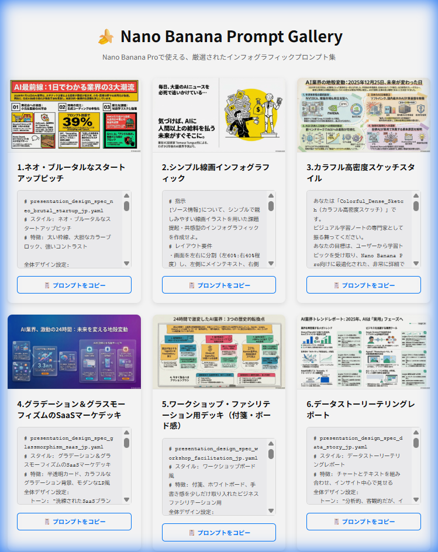

# 🍌 Nano Banana Prompt Gallery

**Nano Banana Pro** で利用できる、厳選されたインフォグラフィックプロンプトを紹介するギャラリーサイトです。

[](https://tetumemo.github.io/nano-banana-prompt-gallery-v2/)

👉 **[デモサイトを見る (GitHub Pages)](https://tetumemo.github.io/nano-banana-prompt-gallery-v2/)**

## 📖 このプロジェクトについて

このプロジェクトは、AIによる画像生成、特に「Nano Banana Pro」ユーザーが活用できる実践的なプロンプト（指示文）を、視覚的にわかりやすく整理・共有するために作成されました。

### Webサイトの特徴

*   **厳選された10種類のデザインパターン**:
    「ネオ・ブルータル」から「手書きスケッチ風」「アイソメトリック図」まで、多彩なデザインスタイルのプロンプトを掲載しています。
*   **コピー機能付き**:
    ワンクリックで長文のプロンプトをコピーし、すぐに画像生成ツールで使用できます。
*   **レスポンシブデザイン**:
    スマートフォン、タブレット、PCなど、あらゆるデバイスで快適に閲覧できます。
*   **画像拡大機能**:
    生成された画像の細部まで確認できる拡大表示機能を搭載しています。

## 🛠️ 技術スタック

*   **HTML5 / CSS3**: モダンでセマンティックなマークアップと、Flexbox/Gridを活用したレイアウト。
*   **Vanilla JavaScript**: ライブラリに依存しない軽量な動作（データの動的生成、モーダル制御、クリップボード操作）。
*   **GitHub Pages**: 静的ホスティングによる高速な配信。

## 🚀 使い方

1.  [サイトにアクセス](https://tetumemo.github.io/nano-banana-prompt-gallery-v2/)します。
2.  気になるデザインのカードを探します。
3.  画像をクリックすると拡大表示され、詳細を確認できます。
4.  「📋 プロンプトをコピー」ボタンを押して、プロンプトをコピーします。
5.  ご自身のAI画像生成ツールにペーストして実行してください。

## 📂 ディレクトリ構成

```text
nano-banana-prompt-gallery-v2/
├── index.html      # メインページ
├── style.css       # スタイル定義
├── script.js       # アプリケーションロジック
├── data.js         # プロンプトデータ（JSON形式の配列）
├── images/         # ギャラリー用画像アセット
├── README.md       # このファイル
└── screenshot.png  # README用スクリーンショット
```

## © ライセンスと著作権

&copy; 2026 tetumemo

このリポジトリのコードはMITライセンスの下で公開されていますが、掲載されているプロンプトおよび生成画像の権利は各作成者に帰属します。
